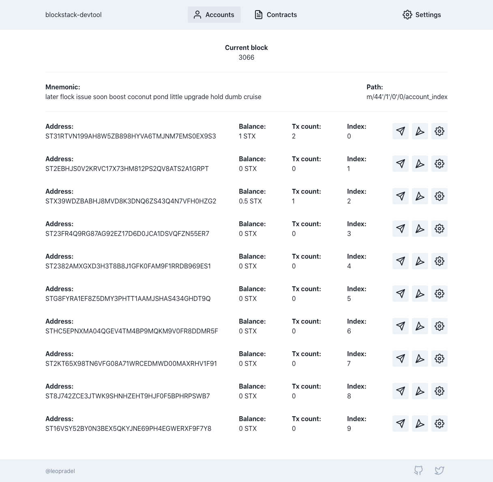

# blockstack-devtool

A simple devtool interface to help you manage different wallets on testnet.

## Features

- Project support, manage the accounts and contracts per project
- Send STX
- Receive STX in one click from faucet
- Easily deploy smart contracts
- Generate a custom 12 words Mnemonic phrase
- Derive 10 accounts (addresses and private keys) from the Mnemonic
- Display informations about the testnet (eg: current block)
- Easy access to the private key of all the accounts for testing (eg: to be reused easily with the blockstack cli)

